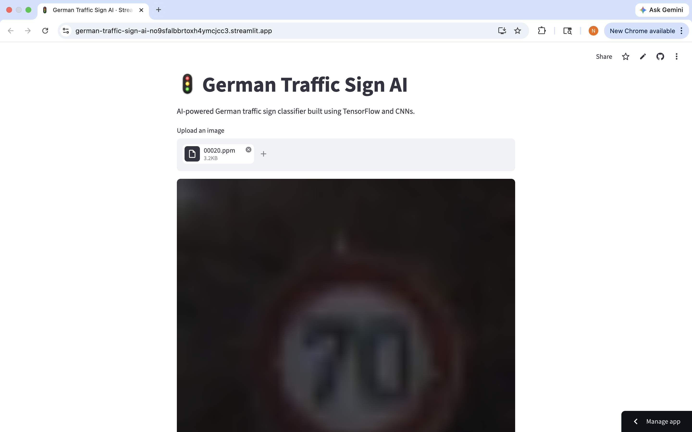
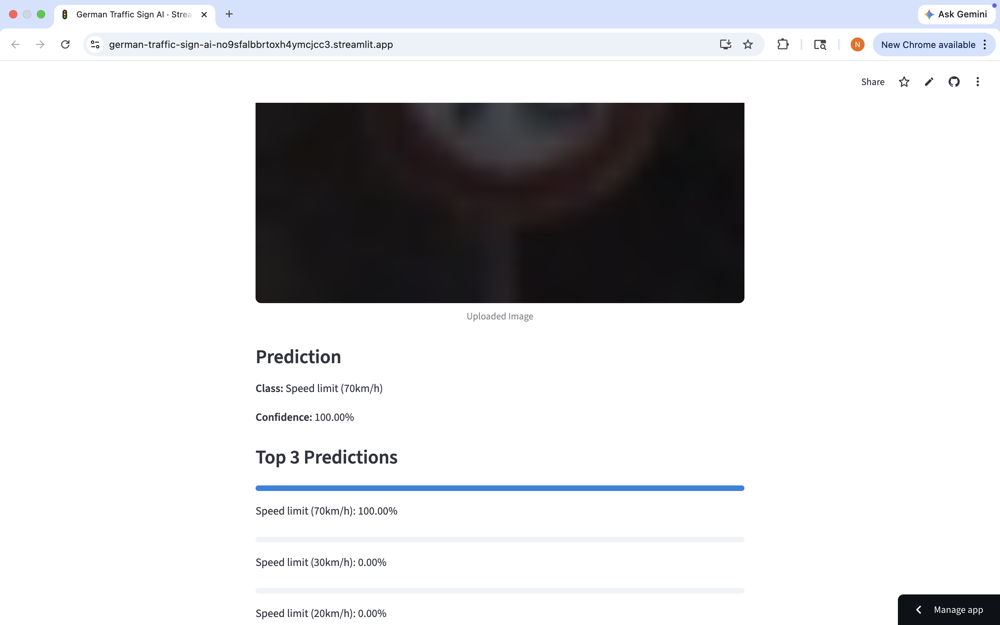
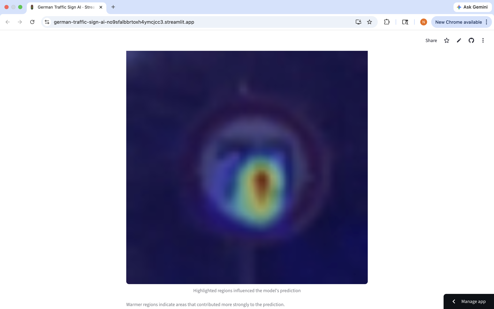

# German Traffic Sign AI 🚦

[](https://german-traffic-sign-ai.streamlit.app/)
[]()
[]()
[]()

An end-to-end **computer vision + explainable AI project** that classifies German traffic signs across 43 classes using deep learning, analyzes model behavior, and serves predictions through a live web application.

## Live Demo

**Try the deployed app here:**  
👉 https://german-traffic-sign-ai.streamlit.app/

Upload a traffic sign image and get:

- Predicted traffic sign class
- Confidence score
- Top 3 predictions
- Grad-CAM explainability heatmap showing where the model focused

---

# Project Overview

Traffic sign recognition is a core computer vision capability for autonomous driving and intelligent transportation systems.

This project builds a full machine learning pipeline using the **German Traffic Sign Recognition Benchmark (GTSRB)** — from dataset exploration and model experimentation to explainability analysis and cloud deployment.

This was intentionally built not just as a modeling exercise, but as a deployable AI product.

---

# Application Preview

## Home Screen



## Prediction Output



## Grad-CAM Explainability



---

# Problem Statement

Given an uploaded traffic sign image, classify it correctly into one of **43 German traffic sign categories**, while also making the model’s reasoning interpretable.

Challenges included:

- Class imbalance
- Varying image dimensions
- Blur / low-light conditions
- Similar-looking warning signs
- Ambiguous visual symbols
- Preventing black-box predictions

---

# Dataset

**Dataset:** German Traffic Sign Recognition Benchmark (GTSRB)

Official sources:

- https://benchmark.ini.rub.de/gtsrb_dataset.html
- https://sid.erda.dk/public/archives/daaeac0d7ce1152aea9b61d9f1e19370/published-archive.html

Dataset characteristics:

- 43 traffic sign classes
- 39,209 training images
- 12,630 official test images
- Real-world lighting variation
- Blur, occlusion, perspective distortions

---

# Project Architecture

```text
Dataset Acquisition
        ↓
Exploratory Data Analysis
        ↓
Image Preprocessing
(resizing, normalization, stratified splitting)
        ↓
Baseline CNN
        ↓
Performance Evaluation
        ↓
Improved CNN
(Data Augmentation + BatchNorm + Dropout)
        ↓
Official Test Benchmark Evaluation
        ↓
Failure Analysis
        ↓
Grad-CAM Explainability
        ↓
Transfer Learning Experiment (MobileNetV2)
        ↓
Streamlit Deployment
        ↓
Live Production App
```

---

# Modeling Journey

## Baseline CNN

Initial custom CNN:

- Conv2D
- MaxPooling
- Flatten
- Dense layers

Purpose:

Establish benchmark performance quickly.

### Result

| Metric                 |  Score |
| ---------------------- | -----: |
| Validation Accuracy    | 99.13% |
| Official Test Accuracy | 96.00% |

Observation:

Strong initial performance, but struggled on:

- blurry signs
- dark images
- similar triangular warning signs

---

## Improved CNN

Enhancements introduced:

### Data Augmentation

Improved robustness against:

- rotations
- translations
- zoom
- real-world distortions

---

### Batch Normalization

Improved training stability and convergence.

---

### Dropout Regularization

Reduced overfitting by preventing excessive neuron co-dependency.

---

### Deeper Architecture

Increased feature extraction capacity for more complex visual patterns.

---

### Result

| Metric                 |  Score |
| ---------------------- | -----: |
| Validation Accuracy    | 99.78% |
| Official Test Accuracy | 98.03% |

Improvement:

```text
+2.03% official benchmark improvement
```

This became the deployed production model.

---

## Transfer Learning Experiment

Experimented with **MobileNetV2** for transfer learning.

Purpose:

Evaluate whether pretrained ImageNet features outperform the custom CNN.

### Result

| Model       | Validation Accuracy |
| ----------- | ------------------: |
| MobileNetV2 |              96.03% |

Conclusion:

The custom CNN outperformed MobileNetV2 for this dataset.

Likely reason:

Traffic sign imagery differs significantly from generic ImageNet object distributions.

---

# Explainable AI (Grad-CAM)

To reduce black-box behavior, Grad-CAM was integrated.

This allows visualization of:

> which regions of the image contributed most strongly to the prediction.

Example insights:

- Clean correctly classified signs showed meaningful focus on semantic sign regions.
- Low-light misclassified examples showed degraded attention consistency.
- Failure modes aligned with poor input quality rather than arbitrary background shortcuts.

This explainability capability is also integrated into the live app.

---

# Failure Analysis

Observed failure cases included:

- low-light traffic signs
- motion blur
- low contrast signs
- ambiguous warning symbols
- visually similar triangular signs

Examples:

- pedestrians vs children crossing
- slippery road vs general caution
- warning signs with degraded internal symbols

Key insight:

The model performs strongly on clean inputs and struggles primarily on genuinely difficult edge cases.

---

# Tech Stack

## Machine Learning

- Python
- TensorFlow / Keras
- NumPy
- Pandas
- Scikit-learn

## Computer Vision

- OpenCV
- Matplotlib

## Deployment

- Streamlit
- Streamlit Community Cloud

---

# Project Structure

```text
german-traffic-sign-ai/
│
├── app/
│   └── app.py
│
├── data/
│
├── models/
│   ├── baseline_cnn_gtsrb.keras
│   ├── improved_cnn_gtsrb.keras
│   └── mobilenetv2_gtsrb_experiment.keras
│
├── notebooks/
│   ├── 01_baseline_and_improvement.ipynb
│   └── 02_transfer_learning_mobilenet.ipynb
│
├── requirements.txt
├── runtime.txt
└── README.md
```

---

# Run Locally

Clone repository:

```bash
git clone https://github.com/nishchal-99/german-traffic-sign-ai.git
cd german-traffic-sign-ai
```

Create environment:

```bash
conda create -n traffic-sign-ai python=3.11
conda activate traffic-sign-ai
```

Install dependencies:

```bash
pip install -r requirements.txt
```

Run application:

```bash
streamlit run app/app.py
```

---

# Lessons Learned

This project reinforced practical ML engineering concepts including:

- dataset imbalance handling
- experimental model iteration
- overfitting mitigation
- model benchmarking
- explainability techniques
- debugging TensorFlow / deployment issues
- translating notebooks into production applications

---

# Future Improvements

Potential upgrades:

- EfficientNet / ResNet experimentation
- confidence calibration
- batch image inference
- REST API deployment
- Docker containerization
- CI/CD automation
- model quantization for edge deployment

---

# Citation

If using the dataset academically:

```bibtex
@INPROCEEDINGS{Stallkamp-IJCNN-2011,
  author={Johannes Stallkamp and Marc Schlipsing and Jan Salmen and Christian Igel},
  booktitle={The 2011 International Joint Conference on Neural Networks},
  title={The German Traffic Sign Recognition Benchmark: A multi-class classification competition},
  year={2011},
  pages={1453-1460}
}
```

---

# Author

**Nishchal Sudeep**

Built as an end-to-end machine learning + computer vision portfolio project.
